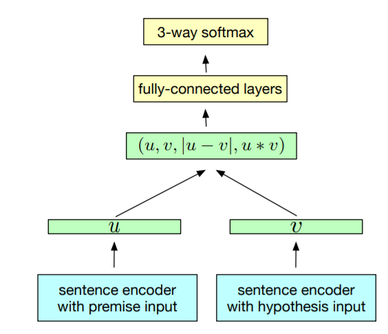
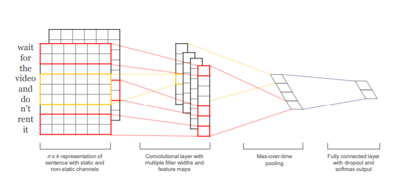
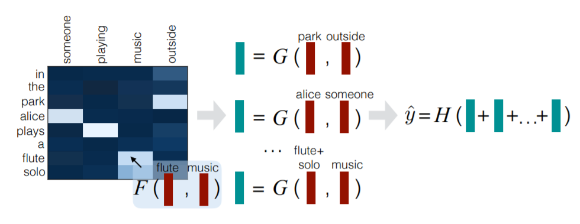

# CHIP2018-平安医疗科技智能患者健康咨询问句匹配大赛 Rank6解决方案

## 1. 特征工程
这部分统计了以下几类特征：
- 基于统计量的特征：q1和q2包含的token个数，unique token的比率，共享token的比率，以及上述特征做四则运算生成新的特征。
- 基于VSM的特征：CountVectorizer和TfidfVectorizer对q1和q2进行向量化，计算q1和q2特征的cosine，L1，L2，Linf距离。
- 基于fuzzywuzzy的特征：字符串模糊匹配生成特征。
- 基于词向量的特征：按idf对词向量进行加权得到句子的表示，计算两个句子向量之间的cosine，L1，L2，Linf距离，以及word mover distance。
- 基于主题模型的特征：使用LDA、LSI、NMF对CountVectorizer/TfidfVectorizer得到的向量进行降维，然后计算cosine,L1,L2,Linf距离，从10维到150维。
- 基于共享前缀后缀的特征：不考虑权重/idf权重/位置倒数权重计算前缀后缀匹配度。
上述特征分别从字和词两个粒度进行了统计，生成了很多冗余特征，用lgbm计算特征重要程度，保留最重要的100个特征。

## 2. 模型
### InferSent

BiLSTM做maxpooling，得到句子的表示q1和q2，然后把q1,q2,|q1-q2|,q1*q2拼接后接全连接层进行分类。

### TextCNN

使用TextCNN代替LSTM对句子进行编码，同样把q1,q2,|q1-q2|,q1*q2拼接后接全连接层进行分类。

### Decomposable Attention

Aggregate中不使用sum而是拼接maxpool和avgpool的结果，其他没有改动。

上述三个模型如果使用特征的话，在全连接层进行拼接。三个模型*使用/不使用特征共六个模型，其中DecomposableAttention+Feature加入集成后表现反而下降，因此最终并没有使用这个模型。

## 3. 集成学习
### stacking
把五个模型的预测结果与100个特征拼接后，用LGBM进行集成(叶子数量7/31/127)，每个深度使用10个种子，共计30个。
### hill climbing
30个LGBM使用hillclimbing进行集成。初始化一个空集S，每轮选择一个预测结果加入S使得S取平均后训练集上的f1值最大，跑100轮，(S中每个模型出现的次数/100)作为模型权重，加权平均作为结果提交。

## 4.失败的尝试
- 数据增强((q1==q2 & q2==q3) ==> q1==q3。(q1!=q2 & q2==q3) ==> q1!=q3。利用这个规则对训练集进行扩充(代价是训练时间显著增加，并且由于训练测试集问题id没有交集，可能新增的question pairs对测试集并没有很大帮助)，但是本地CV分数下降，没有继续尝试)
- 图特征(如果我没记错的话，训练集出现的问题id和测试集中的问题id是没有交集的，另外数据量比较小，感觉图特征不是很有用)
- pseudo label (soft/hard)
- 各种训练技巧(低学习率finetune embedding、跑几个epoch后再finetune embedding、fix embedding跑完后固定其他层参数finetune embedding、adam跑几个epoch换sgd)
- TTA，validation/test时把model(q1,q2)和model(q2,q1)的结果取平均。
- ESIM、LexDecomp、SSE等复杂模型。使用到的三个模型的结构都比较简单，复杂模型像ESIM在本地CV表现不好，猜测可能也是因为数据比较少的原因。
